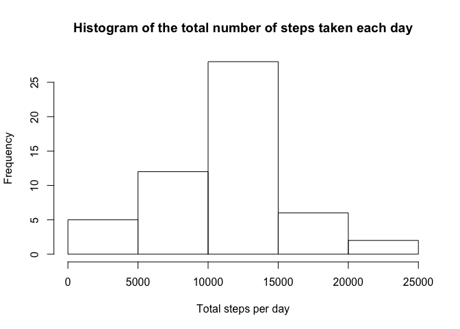
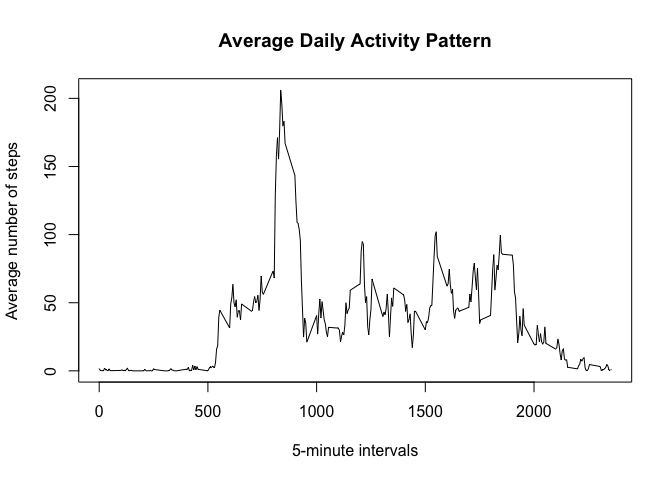
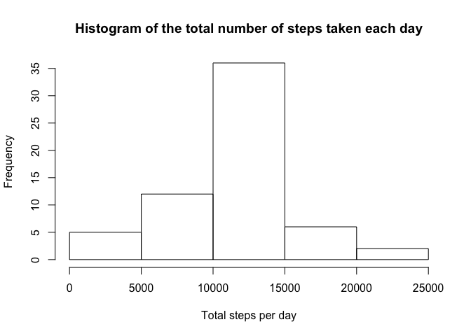
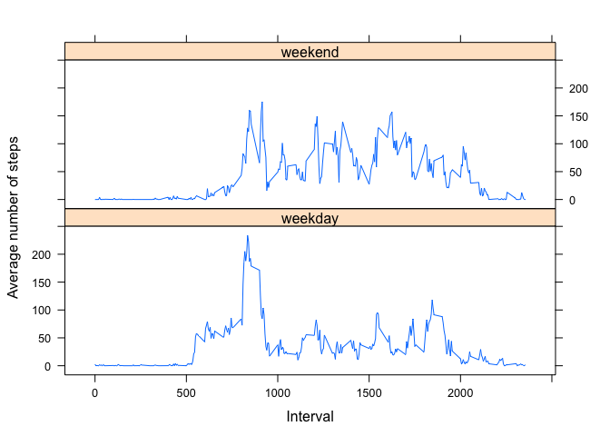

# Reproducible Research: Peer Assessment 1
Dirk Vollmar  
19 April 2015  


# Loading and preprocessing the data

## Load the data

```r
## numbers >= 10^5 will be denoted in scientific notation,
## and rounded to 2 digits
options(scipen = 1, digits = 3)

library(dplyr)
```

```
## 
## Attaching package: 'dplyr'
## 
## The following object is masked from 'package:stats':
## 
##     filter
## 
## The following objects are masked from 'package:base':
## 
##     intersect, setdiff, setequal, union
```

```r
# unzipping data
unzip("activity.zip")

# loading data
data = read.csv("activity.csv")
```

## Preprocessing data


```r
# converting dates
data$date <- as.Date(data$date, format="%Y-%m-%d")
```

# What is mean total number of steps taken per day?

## Calculate the total number of steps taken per day


```r
groupedByDate <- group_by(data, date)
stepsPerDay <- summarize(groupedByDate, totalSteps = sum(steps))
```

## Histogram of the total number of steps taken each day


```r
hist(stepsPerDay$totalSteps, 
     main = "Histogram of the total number of steps taken each day",
     xlab = "Total steps per day")
```

 

## Calculate and report the mean and median of the total number of steps taken per day


```r
mean = mean(stepsPerDay$totalSteps, na.rm=TRUE)
median = median(stepsPerDay$totalSteps, na.rm=TRUE)
```

The mean value of steps taken per day is 10766.189.

The median value of steps taken per day is 10765.

# What is the average daily activity pattern?

## Time series plot of the 5-minute interval and the average number of steps taken (averaged across all days) 


```r
groupedByInterval = group_by(na.omit(data), interval)
averageStepsPerInterval = summarize(groupedByInterval, averageSteps = mean(steps))

plot(averageStepsPerInterval$interval, 
     averageStepsPerInterval$averageSteps, 
     type="l",
     main="Average Daily Activity Pattern",
     xlab="5-minute intervals",
     ylab="Average number of steps")
```

 

## Interval with maximum number of steps


```r
averageStepsPerInterval[which.max(averageStepsPerInterval$averageSteps), 1]
```

```
## Source: local data frame [1 x 1]
## 
##   interval
## 1      835
```

# Imputing missing values
## Calculate and report the total number of missing values in the dataset


```r
totalNumberOfmissingValue <- sum(is.na(data$steps))
```

The total number of missing values in the dataset is 2304.

## Strategy for filling in all of the missing values

For missing values the mean for the 5-minute interval will be used.

## New dataset with missing data filled in


```r
# merge with averaged interval data frame
missingDataFilled = merge(data, averageStepsPerInterval, by = "interval", sort = FALSE)

# sort by date and interval
missingDataFilled = missingDataFilled[with(missingDataFilled, order(date, interval)),]

# replace NA with average 
missingDataFilled$steps[is.na(missingDataFilled$steps)] <- missingDataFilled$averageSteps[is.na(missingDataFilled$steps)]

# remove no longer needed columns
missingDataFilled$averageSteps <- NULL
missingDataFilled$row.numbers <- NULL
```

## Plot a histogram, calculate mean and median


```r
missingDataFilledGroupedByDate <- group_by(missingDataFilled, date)
missingDataFilledStepsPerDay <- summarize(missingDataFilledGroupedByDate, totalSteps = sum(steps))

hist(missingDataFilledStepsPerDay$totalSteps, 
     main = "Histogram of the total number of steps taken each day",
     xlab = "Total steps per day")
```

 

```r
missingDataFilledMean <- mean(missingDataFilledStepsPerDay$totalSteps, na.rm=TRUE)
missingDataFilledMedian <- median(missingDataFilledStepsPerDay$totalSteps, na.rm=TRUE)

meanDifference <- abs(mean - missingDataFilledMean)
medianDifference <- abs(median - missingDataFilledMedian)
```

The mean value of steps taken per day is 10766.189. The absolute difference to the mean without filling missing values is 0.

The median value of steps taken per day is 10766.189. The absolute difference to the median without filling missing values is 1.189.


# Are there differences in activity patterns between weekdays and weekends?

## Add a new factor variable to the dataset


```r
# use en-us locale
Sys.setlocale("LC_TIME", "en_US")
```

```
## [1] "en_US"
```

```r
dataWithWeekday <- mutate(data, 
                          daytype = factor(ifelse(weekdays(date) == "Sunday" | weekdays(date) == "Saturday", "weekend", "weekday")))
```

## Panel plot containing a time series plot of the 5-minute interval and the average number of steps taken, averaged across all weekday days or weekend days.


```r
dataWithWeekdayAvgSteps <- aggregate(dataWithWeekday$steps, by=list(dataWithWeekday$daytype, dataWithWeekday$interval), mean, na.rm=TRUE, na.action=NULL)
names(dataWithWeekdayAvgSteps)[1] = "daytype"
names(dataWithWeekdayAvgSteps)[2] = "interval"
names(dataWithWeekdayAvgSteps)[3] = "mean.steps"

library(lattice)
xyplot(dataWithWeekdayAvgSteps$mean.steps ~ dataWithWeekdayAvgSteps$interval | dataWithWeekdayAvgSteps$daytype,
       layout=c(1,2),
       type="l",
       xlab="Interval",
       ylab="Average number of steps")
```

 

